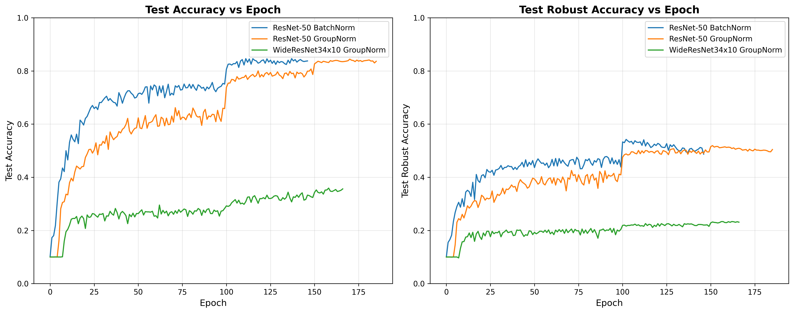

# ResNet and WideResNet with BatchNorm vs GroupNorm: Standard and Adversarial Training

This repository provides implementations and training scripts to compare BatchNorm and GroupNorm in ResNet and WideResNet architectures on CIFAR-10, covering both standard and adversarial training scenarios.

## Overview

The goal of this repository is to systematically compare how different normalization techniques (BatchNorm vs GroupNorm) affect:
- **Standard training performance** on clean images across different architectures
- **Adversarial robustness** when trained with adversarial examples  
- **Training dynamics** and convergence behavior in ResNet and WideResNet
- **Model generalization** across different attack strengths and architectures

## Repository Structure

```
├── resnet_batchnorm.py    # ResNet architecture with BatchNorm
├── resnet_groupnorm.py    # ResNet architecture with GroupNorm  
├── train.py               # Standard training script
├── train_adv.py           # Adversarial training script
├── plot_training_logs.py  # Visualization script for training curves
├── utils.py               # Data loading and utility functions
└── README.md              # This file
```

## Files Description

### Model Implementations
- **`resnet_batchnorm.py`**: ResNet-50/101 with BatchNorm2d normalization, adapted for CIFAR-10 (32×32 input)
- **`resnet_groupnorm.py`**: ResNet-50/101 with GroupNorm normalization (32 groups), adapted for CIFAR-10
  - *Adapted from*: [GroupNorm-reproduce](https://github.com/ppwwyyxx/GroupNorm-reproduce/blob/master/ImageNet-ResNet-PyTorch/resnet_gn.py)

### Training Scripts  
- **`train.py`**: Standard training with clean images only
  - Supports ResNet-50/101 with BatchNorm and GroupNorm
  - Supports WideResNet34x10 with BatchNorm and GroupNorm
  - Multi-GPU training with DataParallel
  - Configurable hyperparameters and data augmentation
  - Saves only the best model based on validation accuracy

- **`train_adv.py`**: Adversarial training script
  - PGD (Projected Gradient Descent) adversarial training
  - FGSM (Fast Gradient Sign Method) attacks
  - Support for L∞ and L2 norm constraints
  - Compatible with ResNet and WideResNet architectures
  - Mixup and Cutout data augmentation options
  - Comprehensive logging for analysis
  - *Adapted from*: [robust_overfitting](https://github.com/locuslab/robust_overfitting/blob/master/train_cifar.py)

### Utilities
- **`utils.py`**: Data loading, preprocessing, and utility functions for CIFAR-10
- **`plot_training_logs.py`**: Visualization script for comparing training curves across different models and normalization techniques

## Training Results

The following plot shows the training curves comparing different normalization techniques across ResNet and WideResNet architectures:



The visualization demonstrates the convergence behavior and performance differences between BatchNorm and GroupNorm in both standard accuracy (left) and robust accuracy against adversarial attacks (right).

### Commands Used

The training curves shown above were generated using the following commands:

```bash
# ResNet-50 with BatchNorm (Adversarial Training)
python train_adv.py --model resnet50 --model-norm batchnorm --attack pgd --epsilon 8 --fname resnet50_batchnorm_adv

# ResNet-50 with GroupNorm (Adversarial Training)
python train_adv.py --model resnet50 --model-norm groupnorm --attack pgd --epsilon 8 --fname resnet50_groupnorm_adv

# WideResNet34x10 with GroupNorm (Adversarial Training)
python train_adv.py --model WideResNet34x10 --model-norm groupnorm --attack pgd --epsilon 8 --fname wideresnet_groupnorm_adv
```

All models were trained for 200 epochs with PGD adversarial training (ε=8/255, 10 iterations) using the default hyperparameters.


